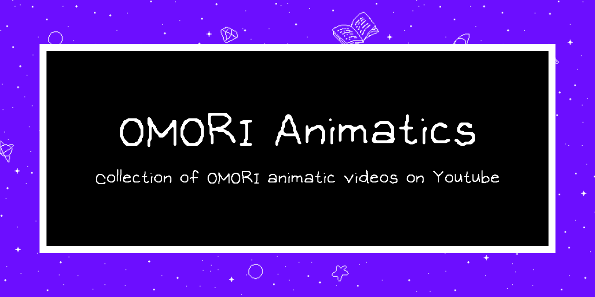

This is a web app that display a collection of OMORI animatic videos, aka fanmade animations on Youtube for the videogame OMORI. This is a beginner project by me to study about data fetching and displaying, and also to study Svelte as a framework.

